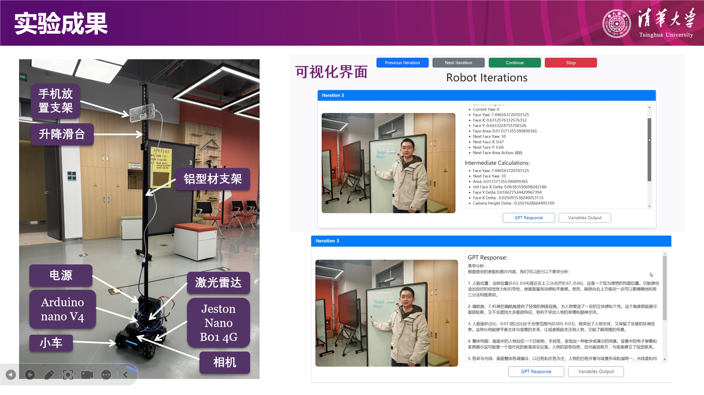
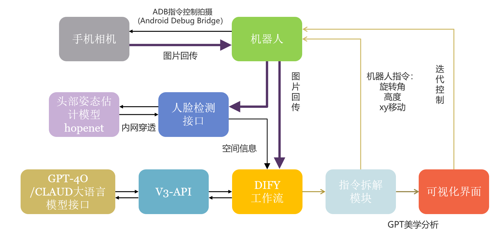
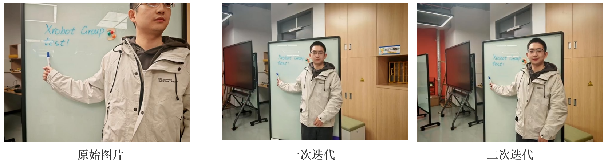

# 第三组-智能摄影师

## 项目简介
在各类活动如讲座、体育赛事和节日庆典中，记录精彩瞬间至关重要。相较于传统摄影师，开发一款具备审美的摄影机器人不仅能减少对专业摄影师的依赖，降低成本，还能迅速部署，持续工作，大幅提升拍摄效率。此外，它还能避免高昂的摄影设备投资，实现成本节约。如何赋予机器人人类“独有”的”审美能力“是本研究的重点，旨在探索基于LLM的具身智能机器人，通过大语言模型赋予其审美能力，以实现自动化拍摄。







## 项目运行

1. 手机打开热点
2. 使用HDMI-HDMI线将机器人连到屏幕，将机器人连到手机热点
   1. 手机上可以查看机器人的IP地址（也可以在机器人上查看）
3. 将自己的电脑连到手机热点
   1. 假设机器人的IP为192.168.1.1，则在自己终端使用`ssh xtark@192.168.1.1`连接到机器人
   2. 密码为：xtark  
4. 在机器人上运行机器人底盘驱动文件：`roslaunch tarkbot_robot robot.launch`
5. 在机器人上运行`ud.py`需要权限，因此在运行前需要用sudo配置权限：`sudo chmod 777 /dev/ttyUSB0`
   1. 然后运行串口通信文件（用于相机高度控制）：`python ud.py`
6. 在机器人上运行机器人移动文件（用于机器人前后、左右、旋转）：`python move_v2.py`（v2中，机器人先旋转再移动）
7. 在服务器上运行人脸识别+头部姿态估计：
   1. 将`my_face_detection_api.py`发布为API接口（位于127.0.0.1:8000）：`uvicorn my_face_detection_api:app --reload`
   2. 将服务器的127.0.0.1:8000从内网穿透到公网：`./ngrok http 8000`
8. 在本地PC使用sftp登录到机器人：`sftp xtark@192.168.1.1`
   1. 在本地修改`x-robot_v7.py`，配置刚才的公网IP
   2. 使用`put`命令将该文件上传的机器人
9. 在机器人上运行机器人的总体逻辑文件：`python x-robot_v7.py`


## 关于调试：
1. 调试机器人的先后、左右、旋转、上下：
   1. Linear中：x代表前后、y代表左右、z代表滑轨的上下
   2. angular中：只能沿z轴旋转，只有在z轴设置旋转量可以控制旋转
```
rostopic pub /cmd/vel geometry_msgs/Twist "Linear: 
    x: 0.0
    y: 0.0
    z: 0.0
angular:
    x: 0.0
    y: 0.0
    z: 0.0"
```
2. 用方向键控制小车的前进后退+旋转：`roslaunch tarkbot_teleop keyboard.launch`
