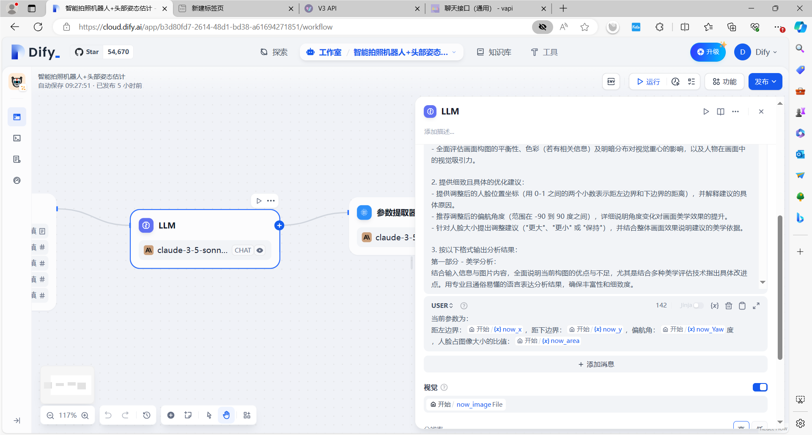
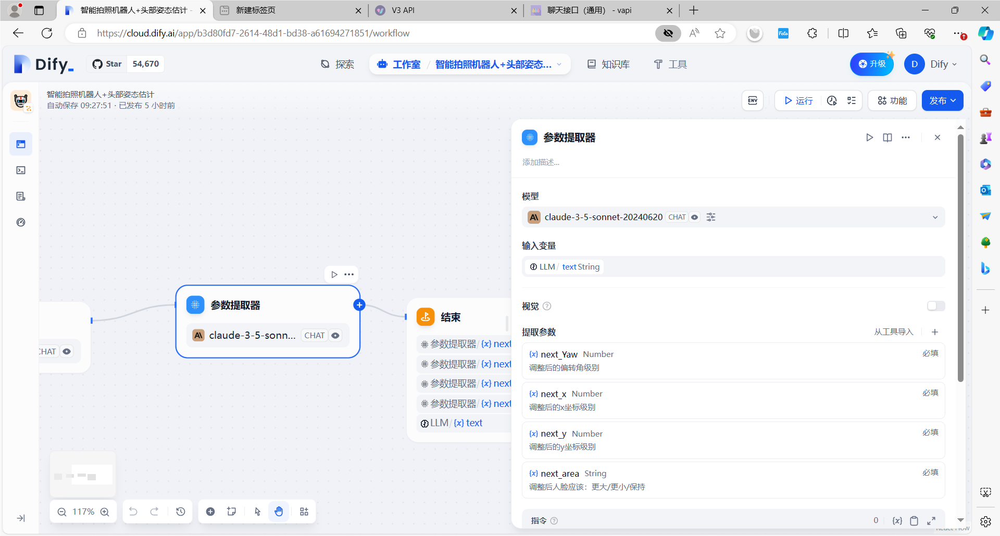
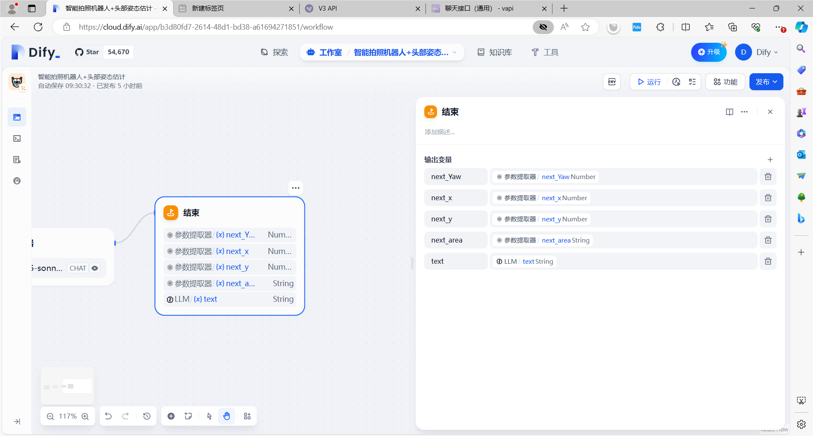
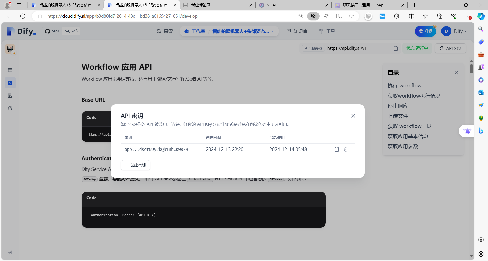
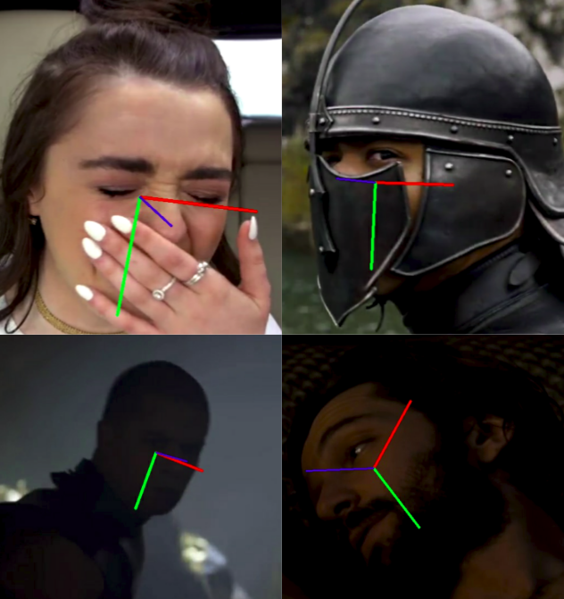
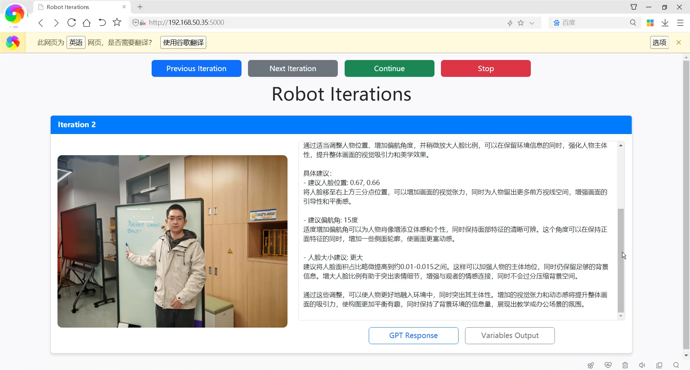

# x-robot 智能拍照机器人：基于GPT驱动的具身智能-技术说明

姓名：李伟宏（软件部分）  学号：2024214471  班级：深计硕41班

整体程序具体流程为：

adb拍照（第3节）-> 调用hopenet进行人脸识别+头部姿态估计（第4节）->调用dify.ai开放的API（第2节）-> 将LLM给出的定性指导转化为具体机器人动作（第5节）

- 其中，第2节工作流内的流程为：外部调用dify.ai中工作流的API（2.4节）-> dify.ai 在LLM节点调用v3 api（第2.1节）-> v3 api调用实际大模型API（第1节）

## 1 LLM接口

[V3 API (v36.cm)](https://api.v36.cm/)

该网址提供了一个可通向各个大模型（包括且不限于open ai的gpt-4o、gpt-o1，以及claud模型等）的API接口。

- 经过测试，gpt-4o经常发生服务器负载过高；gpt-o1无法读取图片；claude-3-5-sonnet-20241022这种最新的大模型也很容易发生服务器负载过高
- 因此本文主要采用claude-3-5-sonnet-20240620

注册后充值，然后就可以得到自己的令牌。（充值满500可以开发票）

## 2 LLM应用开发平台（开源）

[Dify.AI · 生成式 AI 应用创新引擎](https://dify.ai/zh)

在dify中创建了一个工作流。该工作流命名为"智能拍照机器人+头部姿态估计"，其功能为操控机器人拍照，并根据照片决定机器人该如何行动从而得到更好的照片。

## 2.1 在dify.ai中设置模型供应商（即上文的v3api）

API base为：https://api.v36.cm（可以在v3 api中任选一个线路）

API key为：sk-xxxxxxxx（详见v3 api中的令牌）

dify.ai中的各大模型供应商都可以将API key设置为这个key。然后dify.ai就可以通过v3 api访问各大模型供应商的大模型。

## 2.2 工作流搭建

### 2.2.1 工作流中的“开始节点”


在工作流的开始，用户需要上传：

1. 当前拍下的图片 `now_image`
2. 模型预估得到的：
   1. 人脸偏航角 `now_Yaw`
   2. 人脸距离图像左边界的距离 `now_x`
   3. 人脸距离图像下边界的距离 `now_y`
   4. 当前人脸面积占图像的比值 `now_area`

### 2.2.2 工作流中的“LLM节点”（即大模型推理）

我采用claude-3-5-sonnet-20240620，以避免大模型上游服务器饱和（即负载过高）而影响我们的使用。



#### 2.2.2.1 system prompt

我使用的system prompt如下：(使用gpt-o1进行了润色)

```xml
<instruction>
作为专业摄影师，你需要对人像照片进行深入的美学分析并提供构图优化建议。分析过程中需综合提供的人像信息（包括人脸位置、偏航角度、人脸面积占比）与图片本身的内容，同时结合多种美学评估技术，确保分析足够丰富且详细。请按照以下步骤进行：

1. 综合输入信息与图片内容，使用多维度美学评估技术进行全面分析：
- 对比人脸位置与三分法构图原则，分析其与画面整体布局的契合度，特别是对画面张力与视觉引导的影响。（建议参考的三分点坐标：左上约(0.33, 0.66)、右上约(0.67, 0.66)、左下约(0.33, 0.33)、右下约(0.67, 0.33)）
- 运用黄金比例、视觉重心等技术评估当前偏航角是否最优，以及其对人物特征和轮廓展现的影响。
- 分析人脸面积占比是否在合理范围（建议 0.005-0.03 之间），并结合图片背景和其他元素判断画面主体与背景的层次关系。
- 全面评估画面构图的平衡性、色彩（若有相关信息）及明暗分布对视觉重心的影响，以及人物在画面中的视觉吸引力。

2. 提供细致且具体的优化建议：
- 提供调整后的人脸位置坐标（用 0-1 之间的两个小数表示距左边界和下边界的距离），并解释建议的具体原因。
- 推荐调整后的偏航角度（范围在 -90 到 90 度之间），详细说明角度变化对画面美学效果的提升。
- 针对人脸大小提出调整建议（"更大"、"更小" 或 "保持"），并结合整体画面效果说明建议的美学依据。

3. 按以下格式输出分析结果：
第一部分 - 美学分析：
结合输入信息与图片内容，全面说明当前构图的优点与不足，尤其是结合多种美学评估技术指出具体改进点。用专业且通俗易懂的语言表达分析结果，确保丰富性和细致度。

第二部分 - 具体建议：
- 建议人脸位置: [左边界距离], [下边界距离]
- 建议偏航角: [度数]
- 人脸大小建议: [更大/更小/保持]

所有建议需基于专业美学原理与技术，结合图片内容与输入信息，详细阐明调整的原因及预期效果。
</instruction>

<example>
输入:
人脸距左边界0.58, 距下边界0.58, 偏航角40度(右转), 人脸面积占比0.002

输出:
美学分析:
当前人脸位置(0.58, 0.58)接近画面中央区域，缺乏利用三分法或黄金分割点来强化构图张力。偏航角40度虽有一定立体感，但转角过大可能遮挡面部特征，削弱人物识别度。人脸面积占比0.002低于合理范围(0.005-0.03)，使人物在画面中显得过小，不易成为视觉中心。背景元素可能因此获得过多关注，弱化了主体与背景的层次对比。适度放大人脸比例并优化位置与角度，可在保留背景故事性的同时凸显人物主体性。

具体建议:
- 建议人脸位置: 0.67, 0.66（移至右上三分点，提高构图张力和引导力）
- 建议偏航角: 25度（稍减转角，展示更多面部细节，提高识别度与感染力）
- 人脸大小建议: 更大（提高至约0.01，使人物更突出，增强层次关系）

---

输入:
人脸距左边界0.32, 距下边界0.68, 偏航角10度(右转), 人脸面积占比0.04

输出:
美学分析:
当前人脸位置(0.32, 0.68)与左上三分点(约0.33,0.66)相近，但垂直位置偏高导致上部空间略显局促。偏航角10度轻微侧转富有一定立体感，但人脸面积占比0.04高于建议范围(0.005-0.03)，使画面主体过大、背景空间被挤压，层次感减弱。适度下移并缩小人脸比例，可在突出主体的同时保留更多背景信息，使整体更平衡、丰富。

具体建议:
- 建议人脸位置: 0.33, 0.66（调整至左上三分点，改善平衡并增加视觉引导性）
- 建议偏航角: 15度（略微增加侧转加强面部立体感）
- 人脸大小建议: 更小（减少至约0.02，突出主体又不掩盖背景层次）

---

输入:
人脸距左边界0.50, 距下边界0.25, 偏航角-45度(左转), 人脸面积占比0.028

输出:
美学分析:
人脸位置(0.50,0.25)居中偏下，导致重心下移，画面上部过空。偏航角-45度虽提供一定动态感，但过大转角可能遮挡细节。人脸面积占比0.028处于合理范围内（0.005-0.03），可在保有背景细节的同时确保主体清晰度。通过上移位置、减小转角，让面部更易阅读，同时保持适中比例，既保留背景信息又凸显人物层次感。

具体建议:
- 建议人脸位置: 0.33, 0.66（移至左上三分点，提升平衡性和视觉深度）
- 建议偏航角: -30度（适度减小转角，使面部更清晰易读）
- 人脸大小建议: 保持（当前占比合适，可在优化构图的前提下突出主体与背景层次）

</example>
```

#### 2.2.2.2 user prompt

我的user prompt如下：

```
当前参数为：
距左边界：{{#1733122901640.now_x#}}，距下边界：{{#1733122901640.now_y#}}，偏航角：{{#1733122901640.now_Yaw#}}度
，人脸占图像大小的比值：{{#1733122901640.now_area#}}
```

#### 2.2.2.3 视觉输入

注意，在LLM节点中，还需要选择变量 `now_image`作为大模型视觉输入。

### 2.2.3 工作流中的“参数提取器”



同理，我采用claude-3-5-sonnet-20240620，以避免大模型上游服务器饱和（即负载过高）而影响我们的使用。

该参数提取器将上一步得到的LLM文本作为输入，从中提取出参数。

1. 调整后的人脸偏转角 `next_Yaw`
2. 调整后的人脸距离图像左边界的距离 `next_x`
3. 调整后的人脸距离图像下边界的距离 `next_y`
4. 调整后人脸应该"更大/更小/保持" `next_area`

### 2.2.4 工作流中的“结束节点”

如图所示为整个工作流的输出变量。



1. 调整后的人脸偏转角 `next_Yaw`
2. 调整后的人脸距离图像左边界的距离 `next_x`
3. 调整后的人脸距离图像下边界的距离 `next_y`
4. 调整后人脸应该"更大/更小/保持" `next_area`
5. 大模型的应答文本（包括图像美学分析和具体建议）`text`

## 2.3 将dify.ai开放为外部API接口

点击右上角“发布”，再点击“访问API”，查询得到自己当前工作流的API密钥



## 2.4 在外部调用该工作流

具体代码如下所示。`API_KEY`为刚才将dify.ai开放为接口时得到的，需要作为POST中的Authorization。

### 2.4.1 上传图片

工作流中访问图片可以选择**本地上传**/**外部URL**访问。这里我选择从**本地上传**到dify，这样工作流就可以从dify内部的url访问得到图片。

```python

def upload_file(file_path, user):
    """
    上传文件到指定API的函数。

    Args:
        file_path (str): 要上传的文件路径。
        user (str): 用户信息。

    Returns:
        str: 上传成功后返回文件的ID；如果失败则返回None。
    """
    # API的上传文件URL
    upload_url = "https://api.dify.ai/v1/files/upload"
  
    # 设置请求头，包含授权信息
    headers = {"Authorization": f"Bearer {API_KEY}"}
  
    try:
        # 以二进制模式打开文件以进行上传
        with open(file_path, 'rb') as file:
            # 获取文件的扩展名并转换为小写
            suffix = file_path.split('.')[-1].lower()
  
            # 如果扩展名是 'jpg'，将其转换为 'jpeg'
            suffix = 'jpeg' if suffix == 'jpg' else suffix
  
            # 检查文件类型是否支持（仅支持 "png" 和 "jpeg" 格式）
            if suffix not in ["png", "jpeg"]:
                print("Unsupported file type.")
                return None
  
            # 准备上传文件的信息，包含文件名、文件对象和MIME类型
            files = {'file': (os.path.basename(file_path), file, f'image/{suffix}')}
  
            # 设置其他附加数据，例如用户信息和文件类型
            data = {"user": user, "type": "TXT"}
  
            # 配置代理（此处禁用HTTP和HTTPS代理）
            proxies = {
                "http": None,
                "https": None
            }
  
            # 发起POST请求上传文件
            response = requests.post(upload_url, headers=headers, files=files, data=data, proxies=proxies)
  
            # 检查响应状态码，201表示上传成功
            if response.status_code == 201:
                print("File uploaded successfully.")
  
                # 返回上传文件的ID（从响应中提取）
                return response.json().get("id")
  
            # 如果状态码不是201，打印错误信息
            print(f"File upload failed. Status code: {response.status_code}")
  
    # 捕获可能出现的异常，例如文件未找到或网络错误
    except Exception as e:
        print(f"Error: {str(e)}")
  
    # 如果发生异常或上传失败，返回None
    return None

```

注意到，由于在上传图片时（无论是人脸识别还是工作流运行），如果图片太大，非常容易因为网络波动而导致程序运行失败。因此在上传文件前对图片进行压缩非常有必要（大约从3MB压缩至100KB）。

```python
def compress_image(image_path, output_path=None, scale_factor=5):
    if output_path is None:
        output_path = os.path.join('static', 'latest_image.jpg')
    with Image.open(image_path) as img:
        width, height = img.size
        new_width, new_height = width // scale_factor, height // scale_factor
        if not IS_ROBOT:
            img = img.resize((new_width, new_height), Image.Resampling.LANCZOS)
        else:
            img = img.resize((new_width, new_height), Image.ANTIALIAS)
        img.save(output_path)
        print(f"Image compressed and saved to {output_path}")
```

### 2.4.2 运行工作流

`headers`中需要填写用于授权的 `API_KEY`。在 `data`中，需要将开始节点所需的各个变量传进去（对于 `now_image`而言，只上传刚才上传文件后 `response.json().get("id")`得到的 `file_id`即可）

```python
def run_workflow(file_id, user, now_Yaw, now_x, now_y, now_area, response_mode="blocking"):
    """
    调用API运行工作流的函数。

    Args:
        file_id (str): 上传文件的ID，用于标识图像。
        user (str): 用户信息。
        now_Yaw (float): 当前拍摄角度的偏航值。
        now_x (float): 当前X轴坐标值。
        now_y (float): 当前Y轴坐标值。
        now_area (float): 当前图像中的目标区域面积。
        response_mode (str): 响应模式，默认为"blocking"（阻塞模式）。

    Returns:
        dict: 如果工作流执行成功，返回API的JSON响应；失败时终止程序。
    """
    # 工作流的API URL
    workflow_url = "https://api.dify.ai/v1/workflows/run"
  
    # 请求头，包含授权信息和JSON内容类型
    headers = {
        "Authorization": f"Bearer {API_KEY}",
        "Content-Type": "application/json"
    }
  
    # 请求数据，包含输入参数和用户信息
    data = {
        "inputs": {
            # 图像信息，包括传输方法（本地上传，因此只填写刚才得到的file_id即可）、本地文件ID和类型
            "now_image": {
                "transfer_method": "local_file",
                "upload_file_id": file_id,
                "type": "image"
            },
            # 当前拍摄状态参数
            "now_Yaw": now_Yaw,
            "now_x": now_x,
            "now_y": now_y,
            "now_area": now_area,
        },
        # API响应模式
        "response_mode": response_mode,
        # 用户信息
        "user": user
    }
  
    try:
        # 打印提示信息，表示工作流开始运行
        print("运行工作流...")
  
        # 配置代理（此处禁用HTTP和HTTPS代理）
        proxies = {
            "http": None,
            "https": None
        }
  
        # 发送POST请求调用工作流API
        response = requests.post(workflow_url, headers=headers, json=data, proxies=proxies)
  
        # 检查响应状态码，200表示工作流执行成功
        if response.status_code == 200:
            print("工作流执行成功")
  
            # 打印API返回的JSON响应
            print(response.json())
  
            # 返回JSON响应数据
            return response.json()
        else:
            # 如果状态码不是200，打印错误信息并终止程序
            print(f"工作流执行失败，状态码: {response.status_code}")
            exit(0)
  
    # 捕获可能发生的异常，例如网络错误或数据格式错误
    except Exception as e:
        # 打印异常信息并终止程序
        print(f"发生错误: {str(e)}")
        exit(0)

```

# 3 adb控制相机拍照

作为智能机器人的前置步骤，他需要能够控制手机拍照，具体流程包括：打开相机、按下快门、获取刚拍摄的最新照片、下载照片、删除照片。（拍照后等3秒，是为了避免手机还没来得及保存，程序就读照片。这样只会读到这张照片前的最新照片）

```python
def start_camera():
    print("Starting camera...")
    subprocess.run(['adb', 'shell', 'am', 'start', '-a', 'android.media.action.STILL_IMAGE_CAMERA'])
    time.sleep(2)

def take_picture():
    print("Taking picture...")
    subprocess.run(['adb', 'shell', 'input', 'keyevent', '27'])
    time.sleep(3)

today = datetime.date.today().strftime("%Y%m%d")

def get_latest_photo():
    print('Getting latest photo...')
    result = subprocess.run(['adb', 'shell', 'ls', '-lt', f'/sdcard/DCIM/Camera/IMG_{today}_*.jpg'], stdout=subprocess.PIPE, stderr=subprocess.PIPE)
    photos = result.stdout.decode().splitlines()
    if photos:
        latest_photo = photos[0].split()[-1]
        return latest_photo
    return None

def download_photo(photo_path, save_path):
    print(f"Downloading photo from {photo_path}...")
    subprocess.run(['adb', 'pull', photo_path, save_path])

def delete_photo(photo_path):
    print(f"Deleting photo {photo_path} from device...")
    subprocess.run(['adb', 'shell', 'rm', photo_path])
```

主程序中的对应代码如下：

```python
start_camera()
take_picture()
latest_photo = get_latest_photo()
if not latest_photo:
    print("No photo found.")
    break
save_path = os.path.join('static', os.path.basename(latest_photo))
download_photo(latest_photo, save_path)
delete_photo(latest_photo)
```

> 需要注意，这一部分需要在机器人上安装adb，同时手机上需要进入开发者模式并开启“允许USB调试”（另外，最好手机要关闭密码，或者在第一次授权后选择不再进行查询）。

# 4 使用hopenet进行人脸识别+头部姿态估计

在使用adb拍照后、调用工作流前，还需要有一步"人脸识别+头部姿态估计"。这是因为GPT难以理解人在图像中的位置信息和空间旋转信息，这对GPT指导拍照非常不利。因此需要显式的给他一个定量的参考，GPT才能给出一个总体可靠的定性美学指导。

具体而言，GPT能够：

1. 先给出当前场景下什么拍照角度比较好（角度可以决定拍正脸还是侧脸，而具体角度变化量由输入的预估人脸偏航角决定）
2. 再给出当前场景下人处于什么位置比较好（比如考虑三分法构图等，具体位置变化量由输入的左、下边界距离决定）
3. 再给出当前场景下人大概多大比较好（这一点可以由人脸面积占图像面积的大小定量给出）

而这3点可以总结为，GPT需要 当前的人脸偏航角、当前人脸中心点距离图像左边界距离、当前人脸中心点距离图像右边界距离、人脸大小。而这4个变量又可以由hopenet给出。

## 4.1 头部姿态估计模型 hopenet

[natanielruiz/deep-head-pose: 🔥🔥 Deep Learning Head Pose Estimation using PyTorch. (github.com)](https://github.com/natanielruiz/deep-head-pose)

相关论文发表在CVPR2018(workshop)-Fine-Grained Head Pose Estimation Without Keypoints

总体来说，Hopenet是一个准确且易于使用的头部姿态估计网络。模型在300W-LP数据集上进行了训练，并在实际数据上进行了测试，取得了良好的定性性能。



实际使用时需要下载预训练好的模型权重：[300W-LP, alpha 1, robust to image quality (google.com)](https://drive.google.com/open?id=1m25PrSE7g9D2q2XJVMR6IA7RaCvWSzCR)

> 想了解更多关于alpha代表什么的信息，请阅读这篇论文。前两个模型用于验证论文结果，如果用于实际数据，我们建议使用最后一个模型，因为它对图像质量和模糊的鲁棒性更强，并且在视频上给出了良好的结果。

在代码中，通过如下方式加载该模型：

```python
# Load models globally
device = torch.device("cuda" if torch.cuda.is_available() else "cpu")
model = hopenet.Hopenet(torchvision.models.resnet.Bottleneck, [3, 4, 6, 3], 66)
saved_state_dict = torch.load("../model/hopenet_robust_alpha1.pkl", map_location=device)
model.load_state_dict(saved_state_dict)
model.eval()
model = model.to(device)
```

## 4.2 人脸检测模型

hopenet需要人脸检测模型将一张大图片裁剪中只有头部的小图片。这里，我采用 `mmod_human_face_detector.dat`。

1. 通过 https://blog.csdn.net/weixin_53371809/article/details/137211516，可知，dlib.cnn_face_detection_model_v1实现人脸检测可以使用  `mmod_human_face_detector.dat`。
2. 然后通过 https://blog.csdn.net/lan_liang/article/details/84713699/ 可知，下载链接为： http://dlib.net/files/mmod_human_face_detector.dat.bz2 。

下载并解压后，通过如下代码加载。

```python
cnn_face_detector = dlib.cnn_face_detection_model_v1("../model/mmod_human_face_detector.dat")
```

## 4.3 开放为API

仿照 [API 扩展 | Dify](https://docs.dify.ai/zh-hans/guides/extension/api-based-extension) ，使用Python FastAPI 框架开发接口。

```python
from fastapi import FastAPI, File, UploadFile, HTTPException
from pydantic import BaseModel
import cv2
import numpy as np
import torch
import torch.nn.functional as F
from torchvision import transforms
import torchvision
from PIL import Image
import dlib
import hopenet, utils

app = FastAPI()

...


# 定义图像预处理操作的转换序列：先缩放到224x224，再居中裁剪，然后转为Tensor，
# 最后利用 ImageNet 数据集统计值对图像进行标准化。
transformations = transforms.Compose([
    transforms.Resize(224),
    transforms.CenterCrop(224),
    transforms.ToTensor(),
    # mean和std对应ImageNet预训练模型通用的归一化参数
    transforms.Normalize(mean=[0.485, 0.456, 0.406], 
                         std=[0.229, 0.224, 0.225])
])

# idx_tensor用于将网络输出的分类结果转换为角度值。
# 这里创建一个包含0到65的浮点数张量，并放到对应的设备上(device一般为GPU或者CPU)。
idx_tensor = torch.FloatTensor([idx for idx in range(66)]).to(device)

class OutputData(BaseModel):
    x_distance: float
    y_distance: float
    yaw: float
    area: float


@app.post("/face-detection", response_model=OutputData)
async def detect_face(file: UploadFile = File(...)):
    # 从上传文件中读取图片并转换为OpenCV格式的numpy数组
    try:
        image_bytes = await file.read()
        np_img = np.frombuffer(image_bytes, np.uint8)
        image = cv2.imdecode(np_img, cv2.IMREAD_COLOR)
    except Exception as e:
        # 如果出现异常（文件不是有效的图像格式），返回400错误码
        raise HTTPException(status_code=400, detail="Invalid image file")

    if image is None:
        # 如果无法解码出图像，返回400错误
        raise HTTPException(status_code=400, detail="Failed to process image")

    # 将图像从BGR格式转换为RGB格式，因为一些处理函数需要RGB输入
    image_rgb = cv2.cvtColor(image, cv2.COLOR_BGR2RGB)

    # 使用CNN的人脸检测器对图像中的人脸进行检测（dlib的cnn_face_detector）
    dets = cnn_face_detector(image_rgb, 1)
    if len(dets) == 0:
        # 如果未检测到人脸，则返回404错误
        raise HTTPException(status_code=404, detail="No faces detected")

    # 在检测到的人脸中选择置信度最高的一张
    max_conf = 0
    selected_det = None
    for det in dets:
        if det.confidence > max_conf:
            max_conf = det.confidence
            selected_det = det

    if not selected_det:
        # 如果没有高置信度的人脸，则返回404错误
        raise HTTPException(status_code=404, detail="No high-confidence faces detected")

    # 从检测结果中获取边界框坐标（left, top, right, bottom）
    x_min, y_min = selected_det.rect.left(), selected_det.rect.top()
    x_max, y_max = selected_det.rect.right(), selected_det.rect.bottom()

    # 计算人脸边框的宽和高
    bbox_width = abs(x_max - x_min)
    bbox_height = abs(y_max - y_min)

    # 为了更好地进行后续特征提取，对人脸边框区域进行适当扩张
    # 扩张比例：宽增加20%，上方向上扩张30%，下方向下扩张10%
    x_min = max(0, x_min - int(0.2 * bbox_width))
    x_max = min(image.shape[1], x_max + int(0.2 * bbox_width))
    y_min = max(0, y_min - int(0.3 * bbox_height))
    y_max = min(image.shape[0], y_max + int(0.1 * bbox_height))

    # 从原图中裁剪出人脸区域，并转为PIL.Image，再经过预处理管道（transformations）转换为输入张量
    face_img = image_rgb[y_min:y_max, x_min:x_max]
    face_img = Image.fromarray(face_img)
    face_img = transformations(face_img).unsqueeze(0).to(device)

    # 将预处理后的人脸图像输入到模型(model)中进行头部姿态估计（yaw, pitch, roll）。
    # 这里假设model的输出为(yaw, pitch, roll)，每个为多个分类bin的logits。
    yaw, pitch, roll = model(face_img)

    # 将yaw预测值转换为角度。利用softmax得到概率分布，再使用idx_tensor加权求和，并通过公式映射到角度范围。
    yaw_predicted = torch.sum(F.softmax(yaw, dim=1)[0] * idx_tensor) * 3 - 99

    # 计算人脸中心在图像中的归一化距离坐标。x轴归一化：[0,1]从左到右，y轴归一化同理，
    # 并且这里的y_distance采取1 - (center_y / image_height)的形式，可能是为了得到一个从下往上的距离。
    center_x = (x_min + x_max) / 2
    center_y = (y_min + y_max) / 2
    x_distance = center_x / image.shape[1]
    y_distance = 1 - (center_y / image.shape[0])

    # 计算人脸区域相对于整幅图像的比例面积
    face_area_ratio = (bbox_width * bbox_height) / (image.shape[0] * image.shape[1])

    # 返回检测结果，包括人脸中心位置的归一化坐标、yaw角度以及面积比例
    return OutputData(
        x_distance=x_distance,
        y_distance=y_distance,
        yaw=yaw_predicted.item(),
        area=face_area_ratio
    )

```

然后运行：（假设该代码为 `face_detection_api.py`）

```sh
uvicorn face_detection_api:app --reload
```

## 4.4 内网穿透

仿照 [API 扩展 | Dify](https://docs.dify.ai/zh-hans/guides/extension/api-based-extension) ，使用[Ngrok](https://ngrok.com/) 将API开放到公网IP。

具体来说，注册后，参考[Setup - ngrok](https://dashboard.ngrok.com/get-started/setup/linux)，从 https://bin.equinox.io/c/bNyj1mQVY4c/ngrok-v3-stable-linux-amd64.tgz 下载ngrok，然后参考 [API 扩展 | Dify](https://docs.dify.ai/zh-hans/guides/extension/api-based-extension) 解压并配置令牌

```sh
tar -xvzf ngrok-v3-stable-linux-amd64.tgz
```

然后使用如下命令配置令牌即可。

```python
ngrok config add-authtoken xxx
```

然后启动：

```sh
./ngrok http 端口号
```

# 5. LLM给出的定性指导转化为具体机器人动作

最好是能够有一个实际的物理世界模型。但是受限于时间精力，这里我只采用一个粗糙的模型将定性指导转化为具体动作。

具体而言：

1. 机器人应该要先旋转，旋转会改变坐标系
   1. hopenet的坐标系中，人脸顺时针转是正方向
   2. 在本文的坐标系中，摄像机顺时针转也是正方向
   3. 当人脸处于顺时针转动状态时，如果我们希望排到正脸，就希望人脸逆时针旋转，则摄像机需要逆时针旋转
2. 旋转后再基于新的坐标系调整相机高度、机器人的xy位置
   1. 我认为左右是x轴，前后是y轴
   2. 右是x轴正方形，前是y轴正方向

如下命令可以解压出工作量得到的各个值：

> 在2.4节中，通过调用工作流可以得到：
>
> 1. 调整后的人脸偏转角 `next_Yaw`
> 2. 调整后的人脸距离图像左边界的距离 `next_x`
> 3. 调整后的人脸距离图像下边界的距离 `next_y`
> 4. 调整后人脸应该"更大/更小/保持" `next_area`
> 5. 大模型的应答文本（包括图像美学分析和具体建议）`text`

```python
next_Yaw, next_x, next_y, next_area_act,text = result["data"]["outputs"].values()
```

同时还记得我们的hopenet估计得到的各个参数：

> 1. 人脸偏航角 `now_Yaw`
> 2. 人脸距离图像左边界的距离 `now_x`
> 3. 人脸距离图像下边界的距离 `now_y`
> 4. 当前人脸面积占图像的比值 `now_area`

```python
x, y, yaw, area = get_xy_yaw_area(compressed_path)
```

我们希望机器人能够根据指令转到合适地偏航角，则应该顺时针旋转 `-1 * (next_Yaw - yaw)`。

考虑到机器人旋转后，人脸的当前距离图像左边界距离也会发生变化。**经验上地，**相机每旋转10度，人像大约会在图像中移动0.25（假设整个图像的宽为1，则0.25为1/4个图像宽度）。**（TODO：理论上，人像距离相机越远，相机旋转后人像在图像中的移动距离越大，这需要一个更加实际的模型来预估）**

```python
init_face_x_delta = (next_Yaw - yaw) / 10 * 0.25 # TODO area
```

基于此，我们希望旋转后，人脸再通过机器人的左右移动得到的x变化量为 `face_x_delta = next_x - (x + init_face_x_delta)`。同时，希望通过滑轨上下移动得到的y变化量为 `face_y_delta = next_y - y`。

**经验上地，**机器人每横向移动10分米，人像在图像中会横向移动1整个图像宽度；滑轨每纵向移动15分米，人像在图像中会纵向移动1整个图像高度。**（TODO：同理，这依旧和人脸大小比值、人像距离密切相关）**。
因此：

> （注意，这里的实际相机高度变化量要考虑到滑轨的上限，我们的滑轨长度只有6分米）

```python
actural_camera_x_delta = -10 * face_x_delta  # TODO area
camera_height_delta = (-15) * (next_y - y)
actural_camera_height_delta = max(0, min(6, now_height + inter["camera_height_delta"])) - now_height,
```

在实验中，我们发现，小车对角度的控制不太精准，因此我加了一个修正因子 `alpha=0.8`对实际角度变化量进行修正：

```python
"actural_camera_yaw_delta": -1 * (next_Yaw - yaw) * alpha
```

除了上下、左右、旋转，我们还有考虑远近来调整人像大小。**经验上地，**，人像占图像大小的最优比例约为1.6%；机器人每前后移动1分米会使人像比例变化0.4%。因此：

```python
actural_camera_y_delta = -(area - 0.016)/0.004
```

# 6 可视化UI

本实验采用flask得到可视化UI。

```python
import os
import subprocess
import time
import requests
import json
import datetime
from PIL import Image
from flask import Flask, render_template, request, jsonify
import threading

app = Flask(__name__)

# 此处省略了一些代码逻辑（...），例如初始化变量、定义函数、全局变量及condition、continue_iteration和stop_iteration事件等。

@app.route('/')
def index():
    # 渲染主页面模板index.html
    return render_template('index.html')

@app.route('/iterations')
def get_iterations():
    # 返回iterations_data的JSON格式数据，用于前端轮询或Ajax请求获取当前迭代状态
    return jsonify(iterations_data)

@app.route('/control', methods=['POST'])
def control():
    # 根据前端提交的表单(action)来控制后端的迭代流程
    action = request.form.get('action')
    with condition:
        # 如果action是"continue"则设置continue_iteration事件，让后台继续迭代
        if action == 'continue':
            continue_iteration.set()
        # 如果action是"stop"则设置stop_iteration事件，让后台停止迭代
        elif action == 'stop':
            stop_iteration.set()
    # 返回空响应和204状态码表示请求已成功处理，但无需返回数据
    return '', 204

if __name__ == "__main__":
    # 在主程序启动时，创建一个用于后台处理的线程，执行robot_processing函数
    # 传入now_height和now_Yaw作为初始参数
    processing_thread = threading.Thread(target=robot_processing, args=(now_height, now_Yaw))
    processing_thread.start()
  
    # 启动Flask服务，监听0.0.0.0:5000
    # 0.0.0.0意味着可以通过网络地址访问该服务器
    app.run(host='0.0.0.0', port=5000)

```

然后，需要在 `./templates/`下编写一个 `index.html`文件，用于前端展示。



在实际使用中，使用机器人的内网ip地址访问该可视化界面。比如，在服务器中打开：`http://192.168.50.35:5000/`。

当前迭代执行结束后：

1. 刷新当前网页可以得到新的数据
   1. 点击Previous Iteration或者Next Iteration可以查看到前后迭代的情况
2. 点击Continue，机器人接受到信号后会进行下一次迭代
3. 点击Stop，机器人接受到信号后会终止迭代。

另外，在查看当前迭代时，点击GPT Response可以查看当前GPT对图像的美学评估和具体建议；点击Variables Output可以查看程序过程中的所有初始变量、中间变量、输出变量（即控制相机前后、上下、左右、旋转的变量）。


# 7 杂项

**顺便记录一下迭代过程。**

第一次迭代是小车很难正确识别主题+和爽哥的接口有点偏差（我以为是绝对坐标，但实际是相对坐标）

第二次迭代是小车很难正确识别空间位置信息和旋转信息+依旧和爽哥的接口有偏差（应该先旋转再移动，而且sleep(4)会大幅影响旋转角度，需要stop再sleep）


**两大问题。**

现在主要就两个问题，一个是大模型通信慢（考虑用端侧大模型+模型蒸馏）；一个是空间信息感知和操作能力差（使用更准确的物理世界模型）。


**两个小问题。**

一个是连人脸识别的服务器容易波动（考虑用更稳定的公网IP配置）；一个是GPT非常依赖于示例，而且泛化性较差，回答比较死板，对美学的认识有待加强。


**后续发展。**


再往后就是考虑更通用的场景（风景、多人等），还有小车巡航。
